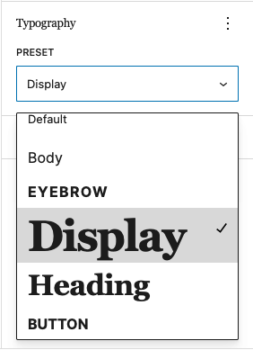

# Theme Typography Presets Demo

Minimal block theme showing one way to implement typography presets in Gutenberg before a core solution exists.

- Typography presets declared in `theme.json` under `settings.custom.typographyPreset`
- Default presets for elements and blocks declared under `settings.custom.defaultTypographyPreset`
- Dynamic front-end stylesheet generation from `theme.json`
- Editor controls that add a `typographyPreset` attribute to blocks with typography support
- A preset selector shown inside the built-in Typography inspector group
- The preset system uses CSS variables generated from `settings.custom`, so updating preset values in `theme.json` propagates automatically.

See the blog post [Theme Typography Presets in Gutenberg](https://cr0ybot.com/2025/02/theme-typography-presets-in-gutenberg/) for more details on the implementation.

## Setup

1. Copy this folder into `wp-content/themes/`.
2. Run `npm install`.
3. Run `npm run build`.
4. Activate the theme.

For development, run `npm run start` to watch editor assets.

## Files

- `theme.json`: token definitions, typography presets, and defaults
- `includes/typography-presets.php`: front-end style generation and block support registration
- `src/editor.js`: editor-side filters and typography preset control
- `templates/index.html`: minimal block theme template
